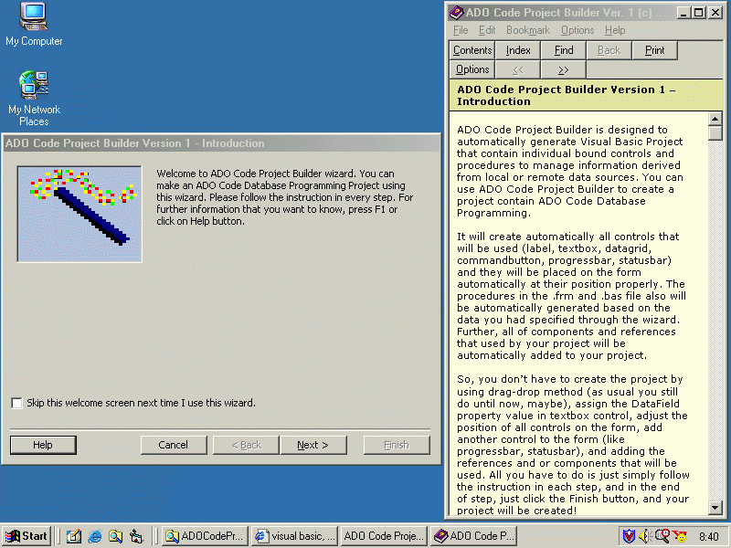



## ADOCodeProjectBuilder Version 1, A Wizard to Build Your ADO Code Project Very Fast and Automatically

### Description

This is the first wizard I made and uploaded to PSC. I never saw the one like this on this site. So I made it. This program/wizard will help you and save a lot of your time to build an ADO Code Project. You can build your ADO Code Project by entering and selecting data/tables/fields based on Database or DSN or parameter you entered/selected to connect to your database. Everything is available in this wizard, included if the .mdb file was password protected. This you can't find in VB Data Form Wizard. So you don't have to build your project from beginning by adding controls on your forms, write the code, adding the components and references, etc. The wizard will automatically add those to your new project. You can also add the find, filter, sort, and bookmark procedure/form to this new project. I made this wizard because I often make ADO Code Database project in my office, and this is really really save a lot of my time. You can learn how to make wizard from this program. I got the template of this wizard from Visual Basic, and I modified as I want to, and I added a Help file that you can call from the wizard. As a matter of fact, this wizard is rather similiar to VB Data Form Wizard in Visual Basic, but I had modified the wizard by adding a lot of enhancements. Please download and prove it now. Any comments, feedback, and votes would be truly appreciated.
 
### More Info
 

             |
---                |---
**Submitted On**   |2003-08-01 13:43:26
**By**             |[Masino Sinaga](https://github.com/Planet-Source-Code/PSCIndex/blob/master/ByAuthor/masino-sinaga.md)
**Level**          |Advanced
**User Rating**    |4.9 (529 globes from 108 users)
**Compatibility**  |VB 6\.0
**Category**       |[Databases/ Data Access/ DAO/ ADO](https://github.com/Planet-Source-Code/PSCIndex/blob/master/ByCategory/databases-data-access-dao-ado__1-6.md)
**World**          |[Visual Basic](https://github.com/Planet-Source-Code/PSCIndex/blob/master/ByWorld/visual-basic.md)
**Archive File**   |[ADOCodePro162392842003\.zip](https://github.com/Planet-Source-Code/masino-sinaga-adocodeprojectbuilder-version-1-a-wizard-to-build-your-ado-code-project-very__1-47384/archive/master.zip)

